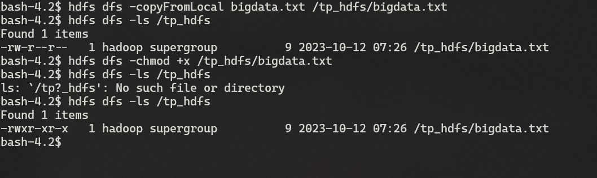

# Big Data - Hadoop

TP on Hadoop to manipulate big data and to discover/explore the concepts.

## Activity 4.1 - CLI

- Create a file w/ "big data" : `echo "big data" > bigdata.txt`
- Create a folder : `hdfs dfs -mkdir /tp_hdfs`
- Copy the file to the folder : `hdfs dfs -put bigdata.txt /tp_hdfs/bigdata.txt`
- Display the content : `hdfs dfs -cat /tp_hdfs/bigdata.txt`
- Display the last kbyte of the file: `hdfs dfs -tail -f /tp_hdfs/bigdata.txt`
- Delete the file : `hdfs dfs -rm /tp_hdfs/bigdata.txt`
- Copy the file in the folder using `copyFromLocal` : `hdfs dfs -copyFromLocal bigdata.txt /tp_hdfs/bigdata.txt`
- Add write permission to the group and others : `hdfs dfs -chmod 666 /tp_hdfs/bigdata.txt`
... => can continue manipulate the filesystem using `hdfs dfs` commands

